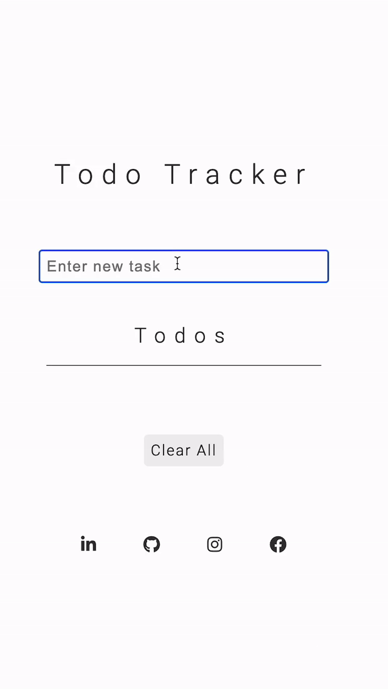

# To-Do Tracker
Welcome to To-Do Tracker! This is a simple web application that allows users to keep track of their to-do tasks easily. The application is built using HTML, CSS, and JavaScript.

###### Access project below
[https://to-do-list-by-chay.netlify.app/](https://to-do-list-by-chay.netlify.app/)

### How to Use
To start using To-Do Tracker, simply click on the provided [link](https://to-do-list-by-chay.netlify.app/) to access the application. Once you're on the website, follow these steps:

1. Type your to-do task in the input box provided.
2. Press the "Enter" key or click on the "Add Task" button to add the task to the list.
3. Each task will be displayed as a list item with a trash can icon beside it.
4. If you want to remove a specific task, click on the corresponding trash can icon.
5. To clear all tasks at once, click on the "Clear All" button.
6. Your tasks will be automatically saved to your browser's local storage. So, even if you refresh the page or come back later, your tasks will be there waiting for you.

### Technologies Used
- HTML
- CSS
- JavaScript

### Setup and Installation
There's no need for any specific setup or installation. To-Do Tracker is a client-side web application, so you only need a web browser to access it. Simply click on the provided link, and you're good to go!

### Contact
If you have any questions or concerns about the project or need any assistance, you can reach out to me via email at chaleyboatmon@gmail.com.

Thank you for using To-Do Tracker! Stay organized and productive! 📝✅